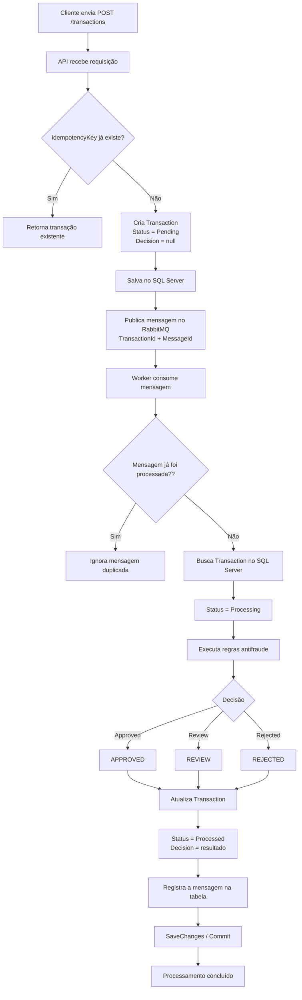

# Fraud Detection Microservice

## Containerização

A aplicação é executada através de Docker Compose.

Os seguintes serviços são containerizados:

* ASP.NET Core API;
* .NET Worker;
* RabbitMQ;
* SQL Server.

A execução completa do ambiente é feita a partir da raiz do projeto:

```bash
docker compose up --build
```

Após a inicialização:

* Swagger: `http://localhost:5001/swagger`
* RabbitMQ Management: `http://localhost:15672`
Usuario: guest
Senha: guest

As migrations do Entity Framework Core são aplicadas durante a inicialização da API.
## Visão Geral

Este projeto implementa um módulo de avaliação antifraude para processamento assíncrono de transações financeiras.

A solução foi estruturada com foco em:

* desacoplamento entre recebimento e processamento;
* idempotência;
* resiliência;
* auditabilidade;
* observabilidade;
* execução containerizada.

O fluxo principal consiste em uma API ASP.NET Core responsável por receber e persistir transações, um RabbitMQ responsável pela mensageria e um Worker .NET responsável pelo processamento antifraude.

## Arquitetura

Os principais componentes são:

* **FraudDetection.Api** — recebe requisições HTTP e disponibiliza os endpoints da aplicação.
* **FraudDetection.Worker** — consome mensagens do RabbitMQ e executa o processamento antifraude.
* **FraudDetection.Application** — contém serviços, contratos e casos de uso da aplicação.
* **FraudDetection.Domain** — contém entidades e enums.
* **FraudDetection.Infrastructure** — contém persistência com Entity Framework Core, repositórios e implementações relacionadas à infraestrutura.
* **RabbitMQ** — atua como message broker entre a API e o Worker.
* **SQL Server** — persiste transações e informações utilizadas para deduplicação das mensagens.
* **MassTransit** — abstrai a integração da aplicação .NET com o RabbitMQ.
* **OpenTelemetry** — utilizado para métricas e distributed tracing.

## Fluxo de Ponta a Ponta

1. O cliente envia uma transação através de `POST /transactions`.
2. A API verifica a `Idempotency-Key`.
3. Caso a chave já exista, a transação anteriormente criada é retornada.
4. Caso seja uma nova operação, a transação é persistida no SQL Server com status inicial.
5. Após a persistência, uma mensagem contendo o identificador da transação é publicada no RabbitMQ.
6. O Worker consome a mensagem.
7. O Worker verifica se aquela mensagem já foi processada anteriormente.
8. Caso seja duplicada, o processamento é ignorado.
9. Caso seja uma nova mensagem, a transação é carregada do banco.
10. As regras antifraude são executadas.
11. A decisão é definida como `APPROVED`, `REJECTED` ou `REVIEW`.
12. A transação e o registro da mensagem processada são persistidos.
13. O cliente pode consultar o estado atualizado através de `GET /transactions/{id}`.

## Idempotência e Deduplicação

A solução trata idempotência em dois níveis.

### API

O endpoint de criação utiliza uma `Idempotency-Key` associada à transação.

Antes de criar uma nova transação, a API verifica a existência da chave. Além disso, a coluna possui restrição de unicidade no banco de dados, protegendo também contra requisições concorrentes.

Dessa forma, múltiplas requisições referentes à mesma operação lógica não resultam na criação de múltiplas transações.

### Worker

O consumidor utiliza o identificador da mensagem para verificar se ela já foi processada anteriormente.

Mensagens concluídas são registradas em uma tabela de controle com chave única para o identificador da mensagem.

Caso a mesma mensagem seja entregue novamente pelo broker, o Worker reconhece a duplicidade e encerra o processamento sem executar novamente as regras antifraude.

A atualização da transação e o registro da mensagem processada são persistidos na mesma unidade de persistência.

## Resiliência

### Retry

O consumer possui uma política de retry configurada através do MassTransit.

Em caso de exceção durante o processamento, a mensagem é processada novamente conforme a política configurada.

### Backoff

Existe um intervalo entre as novas tentativas, evitando retries contínuos e imediatos contra uma dependência temporariamente indisponível.

Essa estratégia reduz o risco de aumentar ainda mais a carga de um serviço ou banco que já esteja apresentando falhas.

### Error Queue / DLQ

Quando todas as tentativas de processamento são esgotadas, o MassTransit encaminha a mensagem para a fila:

`process-transaction_error`

A mensagem permanece disponível para diagnóstico e eventual reprocessamento.

### Fallback

Para cenários onde uma avaliação antifraude dependa de uma integração externa indisponível, uma possível estratégia de fallback seria encaminhar a transação para `REVIEW`, evitando aprovação automática sem uma avaliação completa.

Na implementação atual, esse cenário é tratado como decisão arquitetural e não existe uma integração externa real que demande fallback.

## Observabilidade

A solução utiliza os três principais pilares de observabilidade.

### Logs Estruturados

São registrados eventos relevantes durante o fluxo da transação, incluindo informações como:

* identificador da transação;
* identificador da mensagem;
* decisão antifraude;
* erros de processamento;
* mensagens duplicadas.

### Distributed Tracing

O tracing é implementado através do OpenTelemetry.

São instrumentadas operações da API, acesso ao SQL Server e operações relacionadas ao MassTransit.

Cada aplicação possui seu próprio `service.name`:

* `FraudDetection.Api`
* `FraudDetection.Worker`

Os traces podem ser exportados através do Console Exporter no ambiente local e podem futuramente ser enviados via OTLP para plataformas como Jaeger, Grafana Tempo ou Azure Monitor.

### Métricas

O Worker disponibiliza métricas através de `System.Diagnostics.Metrics` e OpenTelemetry.

Entre as métricas acompanhadas estão:

* quantidade de transações processadas;
* quantidade de erros de processamento;
* mensagens duplicadas;
* resultado das decisões de processamento.

A decisão pode ser utilizada como atributo da métrica de transações processadas, permitindo agregações por `Approved`, `Rejected` e `Review`.

## Contrato da API

### POST /transactions

Cria uma nova transação e agenda seu processamento assíncrono.

A requisição deve possuir uma `Idempotency-Key`.

Fluxo:

`Cliente → API → SQL Server → RabbitMQ`

Após a criação, o processamento antifraude acontece de forma assíncrona.

### GET /transactions/{id}

Retorna os dados atuais da transação, incluindo status e decisão antifraude.

Possíveis decisões:

* `APPROVED`
* `REJECTED`
* `REVIEW`

## Desacoplamento

A API não chama diretamente o Worker.

A comunicação ocorre exclusivamente através do RabbitMQ:

`API → RabbitMQ → Worker`

Dessa forma, API e Worker podem ser executados e escalados de maneira independente.

Caso o Worker esteja indisponível temporariamente, a API continua capaz de receber transações e as mensagens permanecem armazenadas no RabbitMQ até que um consumer esteja novamente disponível.

O MassTransit é utilizado como abstração de mensageria, enquanto o RabbitMQ continua sendo o broker responsável pelo transporte e armazenamento das mensagens.


## Considerações Finais e Limitações

Devido ao tempo disponível para desenvolvimento do case, alguns cenários relacionados à idempotência foram mantidos como pontos de evolução da solução.

### Idempotency Key no Header

Na implementação atual, a `IdempotencyKey` é recebida como parte dos dados da requisição.

Em uma evolução da solução, a chave de idempotência seria recebida através de um header HTTP dedicado, por exemplo:

`Idempotency-Key: <uuid>`

Essa abordagem separaria os metadados relacionados ao controle da requisição dos dados de negócio da transação.

### Reutilização da Idempotency Key com Payload Diferente

A implementação atual identifica uma requisição repetida através da `IdempotencyKey`. Entretanto, não foi implementada a validação do cenário em que um cliente reutiliza a mesma chave para enviar dados de transação diferentes.

Por exemplo:

Request 1:
`IdempotencyKey = ABC`
`Amount = 500`

Request 2:
`IdempotencyKey = ABC`
`Amount = 1500`

Em uma implementação mais completa, a reutilização da mesma chave com um payload diferente deveria ser identificada como um conflito, em vez de ser tratada simplesmente como uma repetição da requisição original.

Uma possível estratégia seria armazenar um hash do payload associado à `IdempotencyKey`. Em novas requisições:

- mesma chave + mesmo payload → retornar o resultado da operação original;
- mesma chave + payload diferente → retornar um conflito, como HTTP `409 Conflict`.

Esses pontos não foram implementados devido à limitação de tempo do case, mas foram considerados como evoluções importantes para tornar o mecanismo de idempotência mais robusto em um cenário de produção.
